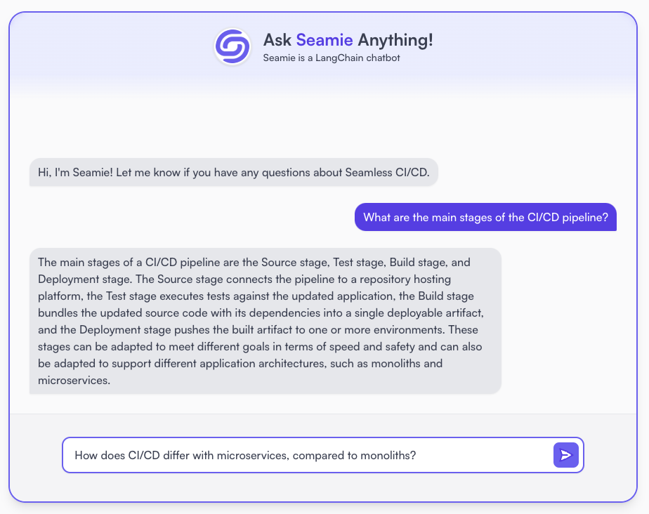

# Recapstone

API for an AI chatbot that answers questions about the [Seamless CI/CD case study](https://seamless-cicd.com/case-study). Used to "recap" concepts from a Capstone project.

- Case study was chunked; embeddings were inserted into Pinecone.
- The 3 most recent AI-Human exchanges are combined with the new query, and summarized into a condensed question by the LLM.
- Top 4 most relevant chunks are retrieved from the vector store, and fed as context for the condensed question, to the LLM.
- Basic FastAPI setup, rate limited.

Try it out: [https://www.jasonherngwang.com/#seamie](https://www.jasonherngwang.com/#seamie)

